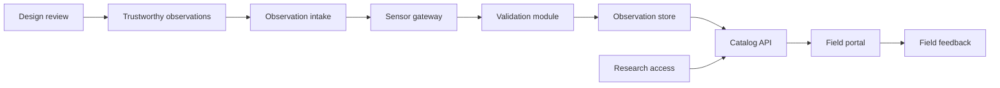

# The station at a glance

```mermaid
flowchart LR
  Goal["Trustworthy observations"] --> Intake["Observation intake"]
  Intake --> Gateway["Sensor gateway"]
  Gateway --> Validate["Validation module"]
  Validate --> Store["Observation store"]
  Store --> API["Catalog API"]
  API --> Portal["Field portal"]
  Portal --> Feedback["Field feedback"]
  Review["Design review"] --> Goal
  Policy["Research access"] --> API
```

Use Fit, zoom and element-local scrollbars. The corresponding knowledge lives in [[Systems/Beacon service]] and [[Systems/Atlas catalog]].
