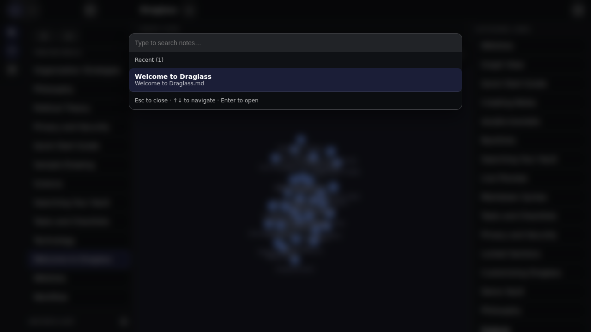
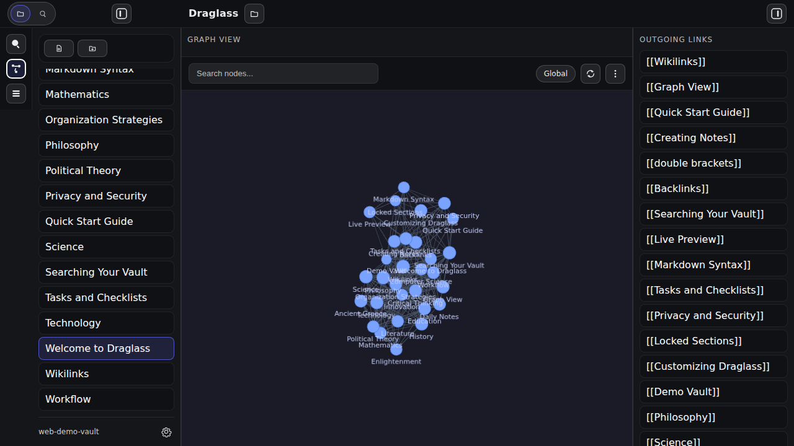
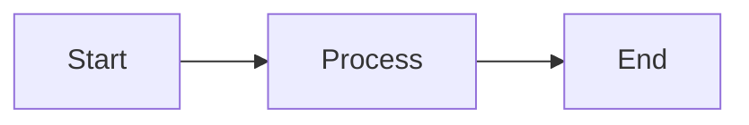

# Features

Draglass is packed with features designed for connected thinking, privacy, and powerful note-taking.

---

## 📝 Notes and Editor

### Markdown Notes
All notes are stored as plain `.md` files in your vault folder. You maintain complete control over your data—no proprietary formats, no lock-in.

### CodeMirror 6 Editor
Powered by CodeMirror 6, one of the most advanced code editors available. Fast, extensible, and built for modern web applications.

### Live Preview Mode
Format as you type with inline rendering:
- **Hidden markup**: Bold, italic, and wikilink syntax disappears, showing only the formatted result
- **Cursor-aware reveal**: Move your cursor into formatted text to see and edit the raw Markdown
- **Clickable elements**: Task checkboxes, wikilinks, and images are all interactive
- **Real-time rendering**: Mermaid diagrams, callouts, and images render inline

### Properties (Frontmatter)
Manage note metadata with an Obsidian-style Properties panel that edits YAML frontmatter.

Features:
- Inline property list with type icons and quick editing
- Collapsible panel to keep the editor focused
- Supported types: Text, Checkbox, Date, Date & Time, Number
- “Add property” flow for new metadata fields

### Source Mode
Toggle to raw Markdown view when you need full control over syntax, formatting characters, and document structure.

### Autosave
Never lose your work. Configurable debounced autosave with visual indicators:
- 🟢 **Green dot**: Saved
- 🔵 **Pulsing**: Saving in progress
- 🔴 **Red dot**: Error (check file system)

Force immediate save anytime with `Cmd/Ctrl + S`.

---

## 🔗 Linking and Navigation

### Wikilinks
Connect notes using `[[Note Name]]` syntax. Create bidirectional connections that mirror how you think.

Features:
- Case-insensitive matching
- Optional display aliases: `[[Note Name|shown text]]`
- Click to open (or create if it doesn't exist)
- Automatic link resolution across your vault

### Backlinks
Every note automatically tracks which other notes link to it. The Backlinks panel shows:
- All incoming links from across your vault
- Live updates as you type new links
- Click-to-jump navigation
- Excluded from view when vault is locked

### Quick Switcher (`Cmd/Ctrl + P`)
Fuzzy search across all note titles. Features:
- **Instant results** as you type
- **Fuzzy matching**: "crit" matches "Critical Thinking"
- **Recent notes**: Quick access to your last 20 opened notes
- **Keyboard navigation**: Arrow keys to select, Enter to open

### Command Palette (`Cmd/Ctrl + Shift + P`)
Searchable list of all app commands:
- New Note
- Rename Current Note
- Delete Current Note
- Lock Current Heading
- Reveal/Hide Private Sections
- Change Vault Password
- Open Demo Vault

### Global Search (`Cmd/Ctrl + Shift + F`)
Full-text search across your entire vault:
- Search in file contents, not just titles
- Results grouped by file with snippets and line numbers
- Case-sensitive toggle
- Click any result to jump to that line
- Respects locked sections (excluded when vault is locked)



---

## 🕸️ Graph View

Visualize your vault as an interactive force-directed network diagram. Every note is a node, every wikilink is an edge.



### Global and Local Modes
- **Global**: See your entire vault at once—all notes, all connections
- **Local**: Focus on the current note and its neighbors within N hops (1-5 configurable)

### Interactive Controls
- **Click a node** to open that note
- **Right-click** for context menu (Open note, Copy path)
- **Drag** to pan around
- **Scroll** to zoom in and out
- **Search** to highlight matching nodes

### Customization
Full control over graph appearance and physics:

**Forces**:
- Center strength (how nodes are pulled to center)
- Repel strength (how nodes push apart)
- Link strength (rigidity of connections)
- Link distance (target spacing)

**Display**:
- Show directional arrows
- Text fade threshold
- Node size
- Link thickness

**Filters**:
- Search query to show only matching nodes
- Show/hide orphan notes (notes with no links)

**Color Groups**:
Add custom color groups with queries to visually distinguish topic areas (e.g., all notes matching "Philosophy" in blue).

### Theme-Aware
Automatically adapts to your chosen dark/light theme.

---

## ✅ Organization and Productivity

### Tasks and Checklists
Write tasks anywhere using standard Markdown checkboxes:

```markdown
- [ ] Open task
- [x] Completed task
- [-] Cancelled task
```

The **Tasks panel** in the right sidebar automatically collects all open tasks from every note in your vault. Click any task to jump directly to its line in the source note.

Features:
- **Vault-wide scanning**: See all open tasks in one place
- **Clickable checkboxes** in Live Preview mode (cycle through open → done → cancelled)
- **Smart filtering**: Completed and cancelled tasks hidden from panel
- **Debounced scanning**: No performance impact on typing
- **Respects privacy**: Tasks in locked sections excluded when vault is locked

### Daily Notes
Create time-stamped entry points for:
- Daily tasks and to-dos
- Meeting notes
- Ideas and observations
- Journal entries

Daily notes link outward to your permanent notes, creating a timeline view via backlinks.

### Folders
Organize notes hierarchically:
- Create folders from the toolbar
- Nested folder support
- Expandable/collapsible tree
- Remembers expanded state across sessions

### File Management
- **Rename**: Click the note title or use Command Palette
- **Delete**: Via Command Palette with confirmation dialog
- **New note/folder**: Toolbar buttons or Command Palette

---

## 🔐 Privacy and Security

### Local-First Design
- All notes stored locally in a folder you choose
- Settings in browser localStorage (or Tauri local storage)
- No network calls, no cloud sync, no telemetry
- Works completely offline

### Locked Sections
Protect sensitive content within notes by marking headings as locked:

```markdown
## Private thoughts {locked}

This content is hidden until you unlock the vault.
```

Features:
- **Heading-level granularity**: Lock individual sections, not entire notes
- **Nested protection**: Sub-headings inherit lock status
- **Vault-wide password**: One password protects all locked sections
- **Secure key derivation**: Password hash using Rust-based KDF (never stored in plain text)
- **Content exclusion**: Locked content hidden from backlinks, tasks, and search results

Commands:
- **Lock Current Heading**: Add `{locked}` marker to current section
- **Reveal Private Sections**: Enter password to unlock
- **Hide Private Sections**: Re-lock without restarting
- **Change Vault Password**: Update password (requires current password)

### Hidden Files
Automatically filters out:
- Dotfiles (`.git`, `.obsidian`, etc.)
- `node_modules`
- `.DS_Store`

Toggle visibility in Settings if needed.

---

## 🎨 Rich Content

### Mermaid Diagrams
Render flowcharts, sequence diagrams, and more inline:

````markdown

````

Features:
- Vector rendering (crisp at any zoom level)
- Theme-aware (follows dark/light theme)
- Toggle rendering on/off in Settings

### Excalidraw Drawings
Embed hand-drawn style diagrams directly in your notes or open standalone drawing files:

````markdown
```excalidraw
{ "type": "excalidraw", "version": 2, "elements": [] }
```
````

Features:
- Live Preview renders Excalidraw blocks as SVG
- Supports `.excalidraw` and `.excalidraw.md` files (including Obsidian Excalidraw format)
- Theme-aware rendering (dark/light)
- Demo Vault includes sample drawings to explore

### Callout Blocks
Styled blockquotes for notes, tips, warnings, and more:

```markdown
> [!note] Note Title
> This is a callout with an icon and color.

> [!warning] Warning Title
> Important information stands out.
```

Supported types: `note`, `tip`, `warning`, `info`, `abstract`, `question`, `success`, `failure`, and more.

### Images
Standard Markdown image syntax with enhanced features:

```markdown

```

- **Inline thumbnails** in Live Preview
- **Click-to-enlarge lightbox** for full-size viewing
- **Alt text captions** in lightbox
- **Wikilink embeds**: `![[image.png]]` syntax

### Tables, Lists, Code Blocks
Full Markdown support including:
- Tables with alignment
- Ordered and unordered lists
- Nested lists
- Fenced code blocks with syntax highlighting
- Inline code
- Horizontal rules

---

## ⚙️ Customization

### Themes
- **Dark mode**: Default theme with easy-on-the-eyes colors
- **Light mode**: Clean, bright alternative

Theme applies to:
- Editor interface
- Graph View
- Mermaid diagrams
- All UI elements

### Layout
**Sidebars**:
- Left: Files and Search tabs
- Right: Outgoing links, Tasks, Backlinks
- Resizable by dragging dividers
- Toggle visibility:
  - `Cmd/Ctrl + B`: Left sidebar
  - `Cmd/Ctrl + Shift + B`: Right sidebar
  - `Cmd/Ctrl + Alt + B`: Both sidebars (distraction-free mode)
- Sizes and states remembered across sessions

### Settings
Comprehensive configuration panel (gear icon in left sidebar):

**Editor**:
- Soft wrap
- Render diagrams
- Render images
- Render callouts
- Theme selection

**Files**:
- Remember last vault on startup
- Show hidden/ignored paths
- Remember expanded folders

**Autosave**:
- Enable/disable autosave
- Debounce delay (ms)

**Backlinks**:
- Enable/disable scanning
- Debounce delay (ms)

**Quick Switcher**:
- Debounce (ms)
- Max results
- Max recent notes

**Reset**: Restore all settings to factory defaults

### Demo Vault
Built-in interactive guide that:
- Opens automatically on first launch
- Demonstrates every feature with real examples
- Always accessible via Command Palette
- Safe to edit and experiment with

---

## 🖥️ Platform Support

### Desktop Application
Native desktop app built with Tauri:
- Windows, macOS, Linux support
- Native file system access
- Small memory footprint
- Fast startup time
- No Electron overhead

### Web Version
Run Draglass in any modern browser:
- In-memory vault with localStorage persistence
- Perfect for demonstrations
- No installation required
- Full feature parity with desktop (except file system access)

---

## 🚀 Performance

- **Fast startup**: Tauri's Rust backend launches in milliseconds
- **Efficient rendering**: CodeMirror 6's viewport-based rendering
- **Debounced operations**: Autosave, backlinks, and task scanning won't slow you down
- **Incremental updates**: Only changed content re-renders
- **Lazy loading**: Large vaults load efficiently

---

## Next Steps

- **[Getting Started](getting-started)** - Install and configure Draglass
- **[Screenshots](screenshots)** - Visual tour of all features
- **[Download](download)** - Get Draglass for your platform

---

[← Back to Home](index) | [Getting Started →](getting-started)
