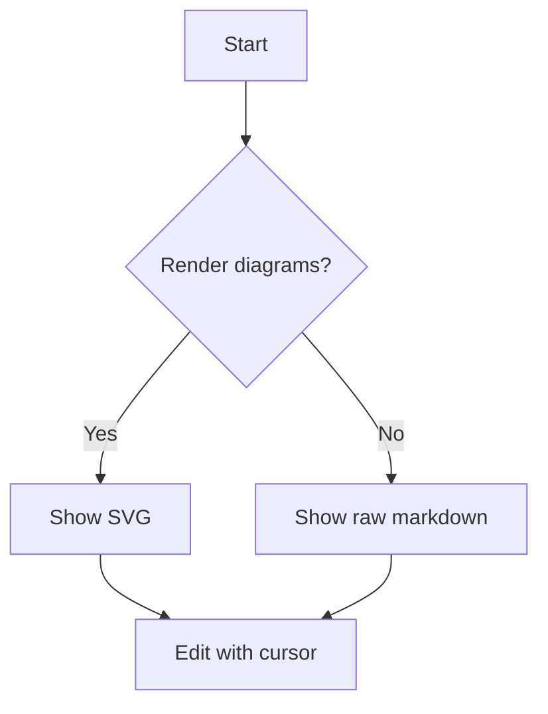
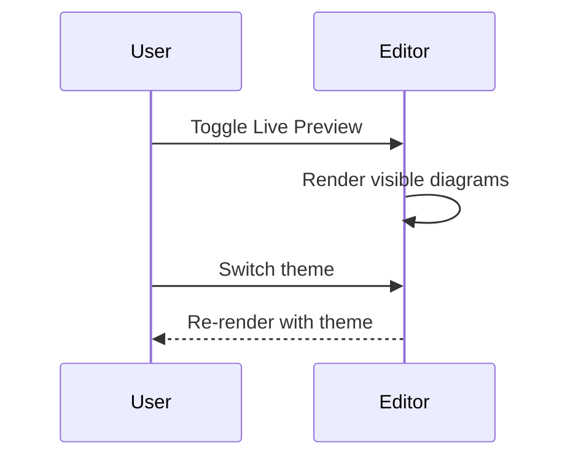

# Mermaid sample

This note is for manual testing of Live Preview diagram rendering.





```mermaid
flowchart LR
  A[Broken syntax example
  B -->
```

Use this broken block to confirm error rendering.
