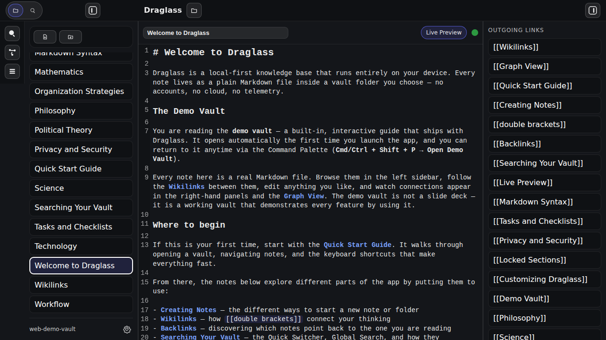
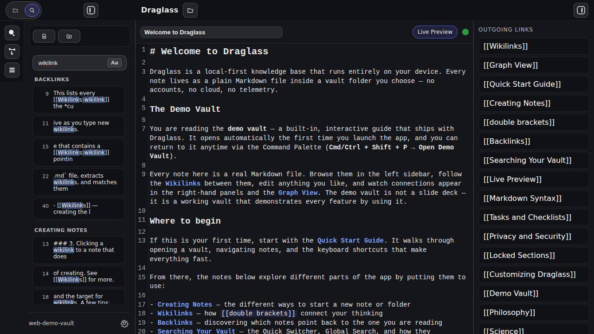
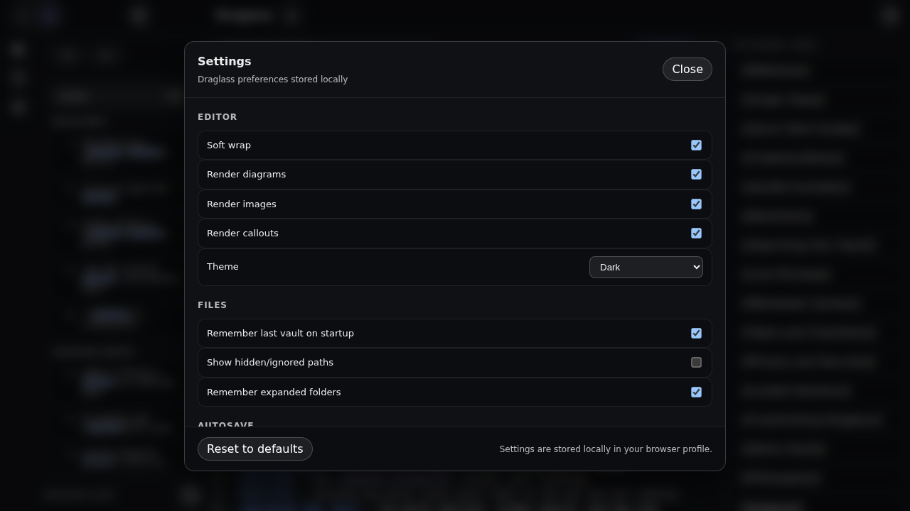
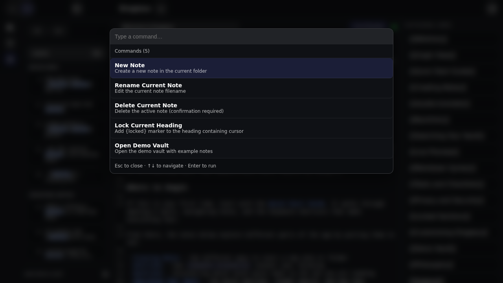
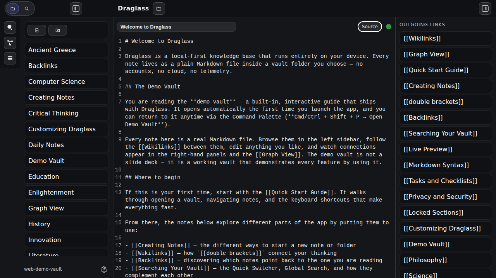

# Screenshots

See Draglass in action with these screenshots from the web version running the Demo Vault.

---

## Main Interface

The Draglass interface with the editor in Live Preview mode, showing a note from the Demo Vault with all sidebars visible.

**Features shown**:
- Left sidebar with file tree showing 28 demo notes
- CodeMirror editor with Live Preview rendering
- Note title with inline rename capability
- Outgoing links panel showing all wikilinks in the current note
- Tasks panel with 13 open checkboxes from across the vault
- Backlinks panel showing 8 notes that link to this one
- Dark theme with clean, distraction-free interface

---

## Graph View

Interactive force-directed network visualization of the entire Demo Vault showing how notes connect through wikilinks.

**Features shown**:
- Global mode showing all 28 notes as nodes
- Force-directed layout with automatic positioning
- Clear visualization of note connections and clusters
- Search bar to filter nodes
- Global/Local mode toggle
- Settings button for customizing appearance and physics
- Philosophy, Science, and Technology notes forming distinct clusters
- Hub notes like "Welcome to Draglass" with many connections

---

## Quick Switcher

Fuzzy search interface for instantly jumping to any note by name.

**Features shown**:
- Modal overlay with search field
- Recent notes section showing last opened note
- "Welcome to Draglass" note displayed with full path
- Keyboard shortcuts displayed at bottom (Esc to close, arrows to navigate, Enter to open)
- Clean, focused interface for rapid navigation
- Graph View visible in background showing context

---

## Left Sidebar - Search View

Full-text search interface for finding content across all notes in the vault.

**Features shown**:
- Search input field at top of left sidebar
- Case-sensitive toggle button (Aa)
- Search results grouped by category (Backlinks, Creating Notes sections visible)
- Each result shows line number and context snippet
- Note file names with match locations
- Results update as you type
- Highlighted search terms in results

---

## Settings Panel

Configuration dialog for customizing Draglass behavior and appearance.

**Features shown**:
- Modal overlay with organized settings sections
- **Editor** section: Soft wrap, render diagrams, render images, render callouts toggles
- **Theme** dropdown: Dark mode selected
- **Files** section: Remember last vault, show hidden paths, remember expanded folders
- **Autosave** settings (visible when scrolling)
- Reset to defaults button
- Settings stored locally in browser profile
- Close button in top-right corner

---

## Command Palette

Searchable command interface for quick access to all app actions.

**Features shown**:
- Modal overlay with command search field
- List of available commands with descriptions:
  - New Note - Create a new note in the current folder
  - Rename Current Note - Edit the current note filename
  - Delete Current Note - Delete the active note (confirmation required)
  - Lock Current Heading - Add {locked} marker to heading
  - Open Demo Vault - Open the demo vault with example notes
- Keyboard navigation hints at bottom (Esc to close, arrows to navigate, Enter to run)
- Currently showing 5 available commands
- Fuzzy search filtering (type to narrow results)

---

## Source Mode

Raw Markdown editing view showing all formatting syntax.

**Features shown**:
- Toggle between Live Preview and Source mode via button in title bar
- All Markdown syntax visible: `#` for headings, `**bold**`, `[[wikilinks]]`
- Syntax highlighting for different Markdown elements
- Line numbers on the left
- Full editor capabilities maintained
- Useful for editing complex structures or troubleshooting formatting
- Same file content as Live Preview, just different rendering
- File list shows all notes in alphabetical order

---

## Interface Components

### Left Sidebar - Files View
- Tree view of all notes organized alphabetically
- Quick access to 28 demo notes
- New note and new folder buttons in toolbar
- Vault path indicator at bottom
- Settings button for configuration

### Left Sidebar - Search View
See the [Search View screenshot above](#left-sidebar---search-view) for full details.
- Full-text search across vault
- Case-sensitive toggle
- Results with snippets and line numbers
- Click-to-jump navigation

### Right Sidebar Panels

**Outgoing Links**:
- All wikilinks in the current note
- 18 outgoing links shown in Welcome note
- Click any link to navigate

**Tasks**:
- 13 open tasks from various notes
- Source note name and path for each task
- Click to jump to exact line

**Backlinks**:
- 8 notes linking to Welcome note
- Automatic discovery of connections
- Updates as you type

### Top Bar
- Draglass logo and branding
- Vault selector button (folder icon)
- Sidebar toggle buttons
- Clean, minimal design

### Toolbox
- Quick Switcher (magnifying glass)
- Graph View (network icon) 
- Command Palette (command icon)
- Vertical layout on left side

---

## Dark Theme

All screenshots show Draglass in **Dark mode**, which features:
- Dark background with light text for reduced eye strain
- Syntax highlighting in editor
- Themed Graph View with appropriate node/edge colors
- Consistent dark palette across all UI elements

**Light mode** is also available and can be toggled in Settings. The theme applies to:
- Editor interface
- Graph View visualization
- Mermaid diagrams
- All panels and dialogs

---

## Live Preview Features

While not fully captured in static screenshots, Live Preview mode provides:
- **Inline rendering**: Formatting appears as you type
- **Hidden markup**: Bold, italic, and link syntax hidden until cursor enters
- **Clickable wikilinks**: Click to navigate without leaving edit mode
- **Rendered diagrams**: Mermaid flowcharts displayed inline
- **Callout blocks**: Styled notes, tips, and warnings with icons
- **Image lightbox**: Click thumbnails for full-size view
- **Task checkboxes**: Click to toggle between open/done/cancelled

---

## Additional Features Not Shown

These features are available but not captured in the current screenshots:

### Global Search
- Full-text search interface accessed via Cmd/Ctrl + Shift + F
- Opens in the main editor area (different from left sidebar search)
- Search across all note contents
- Results with context snippets
- Line numbers for precision
- Case-sensitive option

### Locked Sections
- Password-protected content
- Inline lock indicators in editor
- Excluded from search and tasks when locked
- Secure key derivation

### File Operations
- Rename notes inline (click title)
- Delete with confirmation
- Create folders
- Expandable folder tree

---

## Try It Yourself

The best way to experience Draglass is to run it yourself:

1. **[Follow the Getting Started guide](getting-started)** to install
2. **Run the web version** to see the Demo Vault
3. **Experiment with features** interactively
4. **Build the desktop app** for full file system access

---

## More Information

- **[Full Features List](features)** - Detailed feature descriptions
- **[Getting Started](getting-started)** - Installation and setup
- **[Home](index)** - Project overview and quick links

---

[← Back to Home](index) | [Download →](download)
