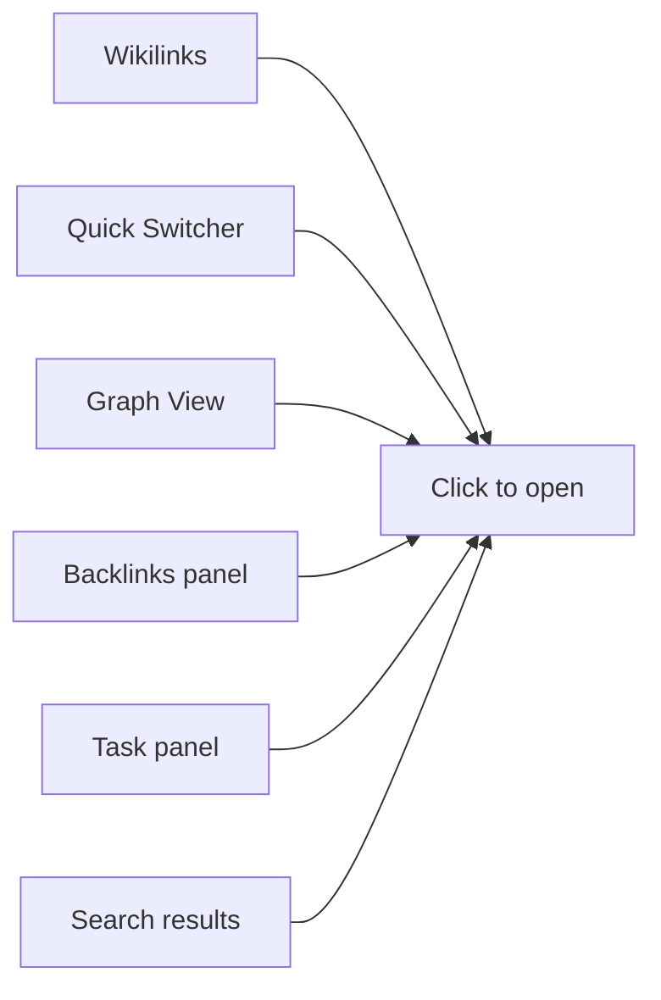

# Live Preview

Draglass has two ways to show your Markdown: **Live Preview** and **Source** mode. Toggle between them with the button in the top-right corner of the editor.

## What Live Preview does

In Live Preview mode the editor renders formatting inline while you type:

- **Heading markers hidden** — `#` symbols are replaced by styled, larger text. A `## Heading` line just looks like a heading.
- **Inline markup hidden** — bold markers, italic markers, backtick delimiters around `code`, and the double-bracket wikilink syntax around [[Wikilinks]] all disappear, leaving only the formatted result.
- **Cursor-aware reveal** — move your cursor into any formatted text and the raw markup reappears so you can edit it. Move the cursor away and the markup hides again.
- **Clickable task checkboxes** — `- [ ]` lines show a real checkbox you can click to cycle through open → done → cancelled (see [[Tasks and Checklists]]).
- **Inline images** — images render as thumbnails; click one to open a full-size lightbox.
- **Mermaid diagrams** — fenced `mermaid` blocks render as vector diagrams.
- **Callout blocks** — `> [!type]` blockquotes display with styled type icons.
- **Locked sections** — a padlock placeholder hides content until you unlock the vault.

> [!tip] Try it now
> Toggle the **Live Preview / Source** button above this editor and watch this callout change between styled and raw Markdown. Then place your cursor on any **bold** word in this note — the `**` markers reappear around it.

## Source mode

Switch to Source mode when you need to see the raw Markdown — for example to double-check a Mermaid diagram's syntax or to edit the `{locked}` marker on a heading. Every formatting character is visible: hash markers, bold delimiters, wikilink brackets, and all.

## Inline images and lightbox

When you include an image with standard Markdown syntax (``) or with a wikilink embed (`!` + double brackets around the filename), Live Preview renders a thumbnail directly in the editor. Click the thumbnail to open a **lightbox** — a full-screen overlay that shows the image at its native resolution with a caption drawn from the alt text. Click outside the lightbox or press **Escape** to close it.

## Mermaid diagrams

Fenced code blocks tagged with `mermaid` render as vector diagrams right inside the note. The diagram theme follows your chosen [[Customizing Draglass|editor theme]] (dark or light). You can toggle diagram rendering on or off in [[Customizing Draglass|Settings]].

Here is an example that maps out ways to navigate between notes:

## Callout blocks

Callouts use a blockquote with a type marker like `> [!note]` or `> [!warning]`. Live Preview renders them with colour and an icon:

> [!note] Note
> This is a note callout. Use it for supplementary information.

> [!warning] Warning
> Callouts are a great way to draw attention to caveats or important details.

Rendering of diagrams, images, and callouts can each be toggled independently in [[Customizing Draglass|Settings]].

## Related

- [[Markdown Syntax]] — the full set of formatting Draglass understands
- [[Customizing Draglass]] — turning rendering options on or off
- [[Wikilinks]] — the links that Live Preview makes clickable
