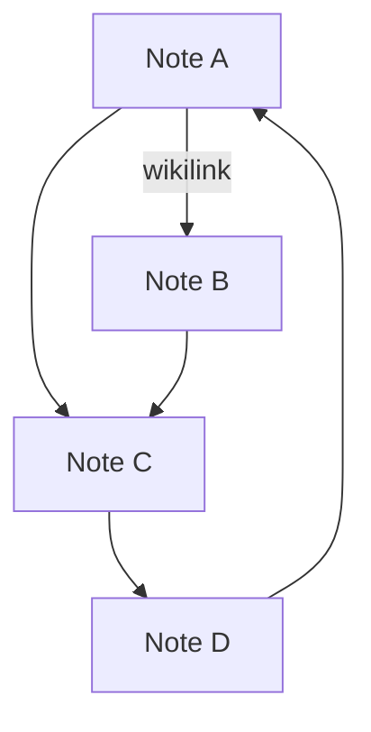

# Graph View

The Graph View renders every note in your vault as a node and every [[Wikilinks|wikilink]] as an edge, producing a force-directed network diagram you can pan, zoom, and click.

Open it from the compass icon in the left-hand toolbar, or look for it in the Command Palette.

## Global vs. Local scope

At the top of the graph you can switch between two scopes:

- **Global** — shows every note and every link in the entire vault.
- **Local** — centres on the currently open note and shows only notes within a configurable depth (1–5 hops).

Local scope is useful when the vault is large and you want to focus on one neighbourhood of ideas.

## Interacting with the graph

- **Click a node** to select it and open the note.
- **Right-click a node** for a context menu: *Open note* or *Copy path*.
- **Drag the background** to pan.
- **Scroll** to zoom in and out.
- **Search** using the text field in the graph header to highlight matching nodes.

## Graph settings

Click the gear icon inside the graph to open the settings panel. You can tune:

### Forces
| Setting | What it controls |
|---|---|
| Center strength | How strongly nodes are pulled to the centre |
| Repel strength | How strongly nodes push each other apart |
| Link strength | How rigidly linked nodes are held together |
| Link distance | The target distance between linked nodes |

### Display
| Setting | What it controls |
|---|---|
| Show arrows | Draw directional arrows on edges |
| Text fade threshold | Zoom level at which labels fade out |
| Node size | Radius of each node circle |
| Link thickness | Width of each edge line |

### Filters
| Setting | What it controls |
|---|---|
| Search query | Only show nodes whose title matches |
| Show orphans | Include notes with no links at all |

### Color groups
You can add named groups with a query and a colour. Any note whose title matches the query is drawn in that colour — handy for visually distinguishing topic areas like [[Philosophy]], [[Science]], or [[Technology]].

## Animation

The settings panel has an **Animate** toggle that replays the force simulation from the beginning, letting you watch the graph settle into shape over about ten seconds.

## Theme awareness

The graph respects the dark/light [[Customizing Draglass|theme setting]]. Nodes, edges, labels, and the background all update when you switch themes.

The simple diagram above illustrates a four-node cycle — the kind of structure that becomes obvious in the Graph View but hard to spot in plain text.

## Related

- [[Wikilinks]] — the links that form the graph edges
- [[Backlinks]] — per-note incoming links
- [[Searching Your Vault]] — text-based alternative to visual exploration
- [[Customizing Draglass]] — the theme and display settings
