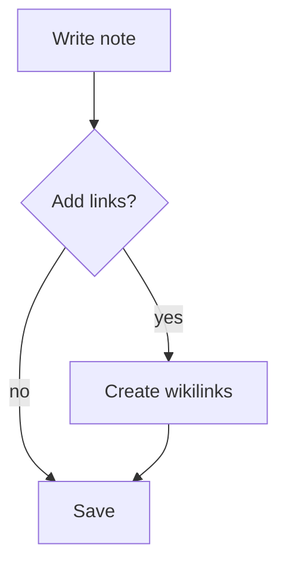

# Markdown Syntax

Draglass notes are plain Markdown files. Everything you write is portable — open the same files in any text editor, render them on GitHub, or convert them with Pandoc. In [[Live Preview]] mode Draglass renders the formatting inline as you type.

## Headings

```markdown
# Heading 1
## Heading 2
### Heading 3
#### Heading 4
```

## Emphasis

- *Italic* with `*asterisks*`
- **Bold** with `**double asterisks**`
- ***Bold italic*** with `***triple***`
- ~~Strikethrough~~ with `~~double tildes~~`

## Strikethrough

Strikethrough renders inline in [[Live Preview]] mode while keeping the original Markdown text.

```markdown
~~This text is struck through~~
```

## Lists

Unordered:

```markdown
- Item one
- Item two
  - Nested item
```

Ordered:

```markdown
1. First
2. Second
3. Third
```

## Task checkboxes

Markdown checkboxes become actionable tasks in Draglass. See [[Tasks and Checklists]] for how the scanner collects them across the vault.

```markdown
- [ ] Open task
- [x] Completed task
- [-] Cancelled task
```

- [ ] This is a real task — check the Tasks panel on the right!

## Links

- Internal link (wikilink): `[[Note Name]]` → see [[Wikilinks]]
- Display alias: `[[Note Name|shown text]]`
- External link: `[text](https://example.com)`

## Images

```markdown

```

In [[Live Preview]] mode the image renders inline with a click-to-enlarge lightbox.

## Code

Inline: surround with backticks `` `code` ``.

Block: triple backticks with an optional language tag.

````markdown
```python
def greet(name):
    return f"Hello, {name}!"
```
````

## Blockquotes

```markdown
> A blockquote. Indent with `>` for each level.
```

## Callout blocks

Callouts are blockquotes with a type marker. [[Live Preview]] renders them as styled cards.

```markdown
> [!note] Title
> Body text goes here.
```

Available types include `note`, `tip`, `warning`, `info`, `abstract`, `question`, `success`, `failure`, and more.

> [!tip] Example
> This is a live callout rendered by Draglass. Switch to Source mode to see the raw Markdown.

## Mermaid diagrams

Fenced code blocks tagged `mermaid` render as vector diagrams when **Render diagrams** is enabled in [[Customizing Draglass|Settings]].



## Locked section markers

Add `{locked}` to a heading to mark everything under it as private. See [[Privacy and Security]] for details.

```markdown
## Private thoughts {locked}
Content hidden until the vault is unlocked.
```

## Horizontal rules

```markdown
---
```

## Tables

```markdown
| Column A | Column B |
|----------|----------|
| Cell 1   | Cell 2   |
```

## Related

- [[Live Preview]] — how Draglass renders formatting inline
- [[Tasks and Checklists]] — the checkbox feature in depth
- [[Privacy and Security]] — locked sections explained
- [[Creating Notes]] — where these Markdown files live
