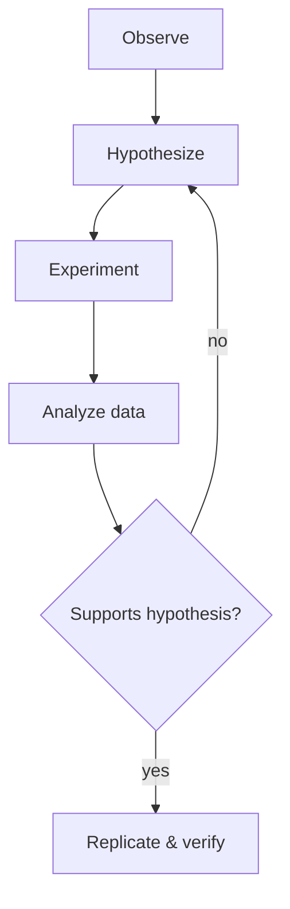

# Science

Science is the systematic study of the natural world through observation and experiment.

## Scientific Method

This approach, rooted in [[Philosophy]] (epistemology), drives progress in all scientific fields.

## Major Domains

### Physical Sciences
- Physics — matter, energy, space, time
- Chemistry — composition and reactions
- Astronomy and earth sciences

### Life Sciences
- Biology — living organisms
- Ecology — interactions in nature
- Medicine — human health

### Formal Sciences
- [[Mathematics]] — patterns and structure
- [[Computer Science]] — computation and information
- Logic — valid reasoning

## Science and Technology

Science and [[Technology]] are deeply intertwined:
- Scientific discoveries enable new technologies
- Technology enables new scientific observations
- Both drive [[Innovation]]

## Science in Society

Science intersects with:
- [[Political Theory]] — science policy
- [[Education]] — scientific literacy
- [[History]] — scientific revolutions

## The Nature of Scientific Knowledge

As explored in [[Philosophy]]:
- Science builds models of reality
- All knowledge is provisional
- Consensus emerges through peer review
- See [[Critical Thinking]] for evaluation skills

> [!tip] Follow the links
> Click [[Mathematics]] or [[Computer Science]] to see how the formal sciences connect. Then check the [[Backlinks]] panel to see what links back here.

Science shapes our understanding of the world and informs practical [[Workflow]] in research and [[Innovation]].

Related: [[Technology]], [[Mathematics]], [[Philosophy]]
