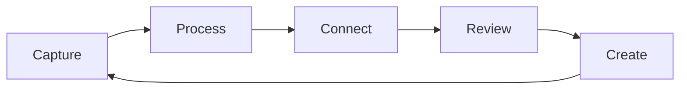

# Workflow

A good knowledge workflow turns scattered notes into a connected thinking tool. Draglass supports each phase of the cycle.

## Capture

Get ideas out of your head quickly:

- Press **Cmd/Ctrl + Shift + P** → **New Note** to start from scratch.
- Type a [[Wikilinks|wikilink]] in any note and click it to create a stub.
- Use [[Daily Notes]] as a running inbox.

Autosave is on by default, so you never lose work. The debounce timer waits for a pause in typing before writing to disk — tune it in [[Customizing Draglass|Settings]] if you want faster or slower saves.

## Process

Once an idea exists, refine it:

1. Expand the note with context.
2. Add [[Wikilinks]] to related topics.
3. Move the note into the right folder if you use [[Organization Strategies|folder-based organisation]].
4. Mark tasks with `- [ ]` so the [[Tasks and Checklists|task scanner]] picks them up.

## Connect

Connections are where the real value lives:

- **Write wikilinks** as you think — don't wait for the perfect moment.
- **Check backlinks** in the right sidebar. A note you link to may link back to something you hadn't considered.
- **Browse the [[Graph View]]** to spot clusters, orphans, and bridges between topics.
- **Use [[Searching Your Vault|Global Search]]** to find notes you forgot to link to.

## Review

Regular review keeps your vault alive:

| Cadence | Action |
|---|---|
| Daily | Scan [[Daily Notes]] for loose threads |
| Weekly | Check the [[Tasks and Checklists|Tasks]] panel for stale items |
| Monthly | Open [[Graph View]] and look for orphans |

> [!note] Keyboard shortcut reminder
> **Cmd/Ctrl + P** opens the Quick Switcher for fast note-hopping during review.

## Create

Synthesis is the payoff. Once you have enough connected notes, write something new:

- A summary note that weaves together [[Philosophy]], [[Science]], and [[Technology]].
- A longer essay drawing on [[Literature]] references.
- A project plan that links to design notes, research, and tasks.

The vault grows richer with every round of the cycle.

## Tool integration

Because your vault is just a folder of Markdown files, you can layer other tools on top:

- Version control with Git
- Reference managers for [[Literature]]
- External editors when you need one
- File sync services for cross-device access (Draglass stays offline — the sync tool moves the files)

## Learning by doing

This demo vault is itself a working example of the workflow above. Browse its notes, follow the links, check the [[Graph View]], and edit freely — it is a safe place to experiment before you create your own vault.

## Adjusting over time

Start simple. Add folders, tasks, and locked sections only when you feel the need. The best workflow is the one you actually use — and [[Customizing Draglass|Draglass's settings]] let you evolve it without fighting the tool.

## Related

- [[Daily Notes]] — the capture half of the cycle
- [[Tasks and Checklists]] — tracking what needs doing
- [[Organization Strategies]] — structuring the vault
- [[Graph View]] — seeing the big picture
- [[Customizing Draglass]] — tuning autosave, panes, and more
